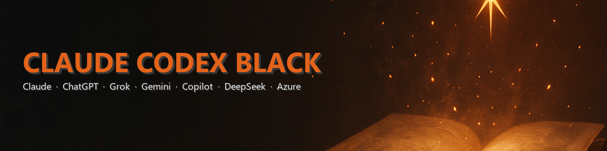

# Claude Codex Black

Claude Codex Black extension with support for Claude / GPT / Grok / Gemini / CoPilot / DeepSeek / Azure. Need help on your next project? Call (724) 431-5207 today! Websites, extensions, mobile development, application development - whatever you need! Production-level code at fair prices with lightning-fast turn-around! Portfolio: https://trentontompkins.com.

This extension is fully self-contained. It does not modify, hook, or depend on any other VS Code extension at runtime.

**Copyright 2026 Trent Tompkins — trentontompkins.com**

## Install

```
code --install-extension codex-black-ed-1.5.3.vsix
```

## Use

Run the command **Claude Codex Black: Open Panel** from the command palette, or press `Ctrl+Alt+B` (`Cmd+Alt+B` on macOS).

A panel titled **Claude Codex Black** opens in a side column and renders the chat workbench. Every slash command (`/help`, `/handbook`, `/clear`, `/settings`, `/prompts`, `/history`, `/font`, `/attach`, `/folder`, `/compact`, `/compress`, `/git`, `/github`, `/license`, `/push`, `/switch-accounts`) also has a matching VS Code command available from the Command Palette.

## Build

```
npm install
npx vsce package
```

## Trademark notice

"Claude" is a trademark of Anthropic, PBC. "Codex" is a trademark of OpenAI.
This extension is an independent, unofficial third-party tool that integrates
with Claude, ChatGPT, Grok, Gemini, GitHub Copilot, DeepSeek, and Azure OpenAI
via each provider's own published APIs. It is not affiliated with, endorsed by,
or sponsored by Anthropic, OpenAI, xAI, Google, GitHub/Microsoft, DeepSeek, or
any other trademark holder. All product names are used in their descriptive /
nominative sense for the sole purpose of identifying which service the
extension can talk to.
